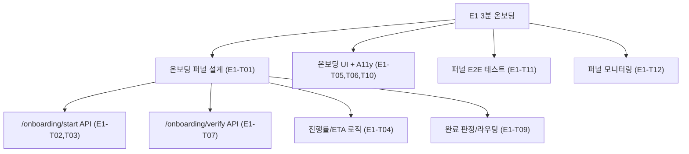
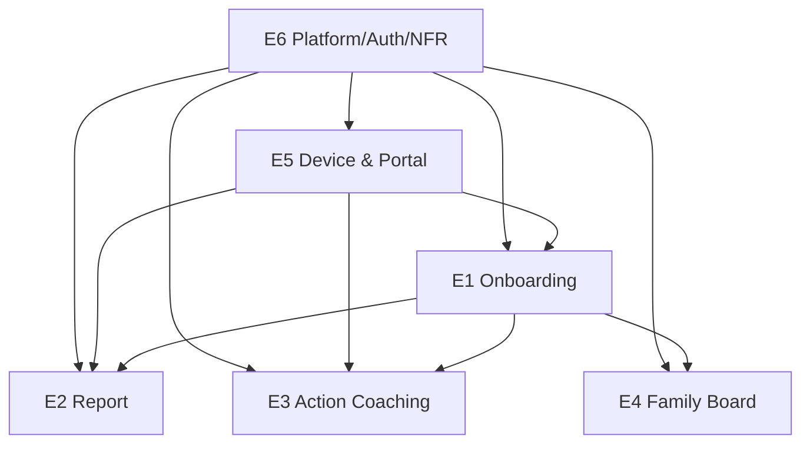

초기에 짧게 요약하면, 지금부터는 계획 파일을 기준으로 10개 To-do를 순서대로 처리하면서, Epic 정의 → REQ 인벤토리/매핑 → MVP 범위 표 → Epic별 WBS/Task → DB/NFR Task → WBS/그래프 → 통합 Backlog → 추적 규칙까지 모두 산출물 형태로 만들어 드리겠습니다. 산출물은 별도 Markdown 문서로 정리하고, 진행하면서 To-do 상태를 in_progress/완료로 갱신하겠습니다.

[3 tools called]

지금 `SRS_V0.3.md`를 다시 읽어왔고, 전체 디렉터리 구조도 확인했습니다. 먼저 Epic 정의(E1~E6)를 구체화해서 별도 산출물로 정리한 뒤, 이어서 REQ 인벤토리/매핑 작업으로 넘어갈게요.

[1 tool called]

To-do 항목이 중복으로 잡혀 있어서, 원래 생성되어 있던 첫 번째 To-do를 기준으로 in_progress로 바꾸고 나머지는 그대로 두겠습니다. 이어서 Epic 정의 결과는 별도 문서/요약 형태로 만들어 드릴게요.

[1 tool called]

### 1. Epic 정의 (To-do 1)

우선 `SRS_V0.3.md`와 `GPT-PRD.md`를 기준으로 **MVP용 Epic(E1~E6)** 를 이렇게 정리하겠습니다.

- **E1. 3분 온보딩 (3-Minute Onboarding)**
  - **목적**: 신규 사용자가 설치 후 **가입→인증→권한→디바이스/병원 연동을 p50 180초 이내**에 완료하고, 첫 가치(리포트 또는 행동 카드)에 도달하게 하는 온보딩 경험을 제공.
  - **범위**: `REQ-FUNC-001~006, 019` + `REQ-NF-001, 003, 008, 012`.
  - **성공 기준(예)**: 온보딩 완료율 ≥ 65%, p50 완료시간 ≤ 180초, 접근성 온보딩 화면 A11y 완전성 100%.

- **E2. 1장 의사용 요약 리포트 (One-Page Doctor Summary)**
  - **목적**: 최근 3~6개월 데이터를 **의료급 포맷의 1장 리포트**로 요약해, 진료 현장에서 **신뢰도 높은 요약·EMR 첨부**가 가능하도록 하는 것.
  - **범위**: `REQ-FUNC-007~010` + `REQ-NF-002, 008, 011, 016`.
  - **성공 기준(예)**: 리포트 생성 p95 ≤ 3초, PDF/EMR 첨부 실패율 < 0.5%, 채택률 ≥ 40%.

- **E3. 오늘 1~3개 행동 코칭 (Action Coaching)**
  - **목적**: 시니어의 상태에 맞는 **하루 1~3개의 행동 카드**를 생성·알림하여, **피로도를 줄이면서 습관 형성(D1/W1)** 을 돕는 것.
  - **범위**: `REQ-FUNC-011~014` + `REQ-NF-001, 005, 012, 015`.
  - **성공 기준(예)**: 일일 카드 1~3개, 야간 자동 침묵, D1 완료율 ≥ 25%, W1 3일 달성률 ≥ 50%.

- **E4. 가족 보드 & 대리 접근 (Family Board & Delegation)**
  - **목적**: 시니어·보호자·가족이 **일정·복약·위험 알림을 공유하고 역할/권한을 관리**할 수 있는 가족 보드와 대리 접근 경험 제공.
  - **범위**: `REQ-FUNC-015~017, 018` + `REQ-NF-005, 006, 007, 013`.
  - **성공 기준(예)**: 가족 대리접근 설정률 ≥ 50%, 변경 전파 지연 p95 ≤ 60초, 위험 접근 시 2FA 100% 적용.

- **E5. 디바이스 & 병원 포털 연동 (Device & Portal Connect)**
  - **목적**: 최소 1종 이상 디바이스, 최소 1개 병원/검진 포털과 **안정적인 데이터 연동**을 제공해, 리포트/행동 코칭에 사용할 수 있는 의료급 데이터를 확보.
  - **범위**: `REQ-FUNC-003, 004, 019` + `REQ-NF-005, 006, 009, 019`.
  - **성공 기준(예)**: 디바이스 1종 정상 연동, 병원 포털 1곳 이상 연동(또는 업로드 채널 대체), 연동 실패율 < 1%.

- **E6. 공통 Auth/Consent & 플랫폼/NFR (Platform & Cross-Cutting)**
  - **목적**: **인증/토큰/동의/감사 로그·보안·가용성·비용·모니터링·확장성/유지보수성** 등 공통 플랫폼 요구사항을 구현.
  - **범위**: `/api/auth`, `/api/consent` 및 `REQ-NF-001~010, 017, 018` 일부, + 보안/접근성/가용성 플랫폼.
  - **성공 기준(예)**: TLS1.2+, AES-256 적용, 월 가용성 ≥ 99.5%, 주요 NFR 모니터링 및 알림 체계 구축.

---

### 2. REQ 인벤토리 및 Epic 매핑 (To-do 2)

#### 2.1 Functional REQ → Epic 매핑

- **Functional REQ-FUNC-001~019** 를 Epic 기준으로 이렇게 매핑합니다.

```markdown
| REQ ID        | Title 요약                          | Primary Epic | Also Impacts   |
|---------------|--------------------------------------|--------------|----------------|
| REQ-FUNC-001  | 계정 생성 및 기본 프로필 등록       | E1           | E6 (Consent)   |
| REQ-FUNC-002  | 온보딩 인증 단계                    | E1           | E6 (Auth)      |
| REQ-FUNC-003  | 디바이스 연동(최소 2종)             | E5           | E1             |
| REQ-FUNC-004  | 병원 포털 연동(최소 1곳)            | E5           | E1             |
| REQ-FUNC-005  | 온보딩 진행률 표시 및 중간 저장     | E1           | E6 (A11y)      |
| REQ-FUNC-006  | 온보딩 완료 조건 평가               | E1           | E2/E3(첫 가치) |
| REQ-FUNC-007  | 1장 리포트 생성                     | E2           | E5             |
| REQ-FUNC-008  | 리포트 메타데이터(맥락/기기/기간)   | E2           | E5             |
| REQ-FUNC-009  | 리포트 PDF/인쇄/EMR 첨부            | E2           | E6 (Security)  |
| REQ-FUNC-010  | 접근성 모드 리포트 뷰               | E2           | E6 (A11y)      |
| REQ-FUNC-011  | 일일 행동 카드 생성                 | E3           | E5             |
| REQ-FUNC-012  | 행동 카드 알림/야간 자동 침묵       | E3           | E4             |
| REQ-FUNC-013  | 행동 카드 완료 추적                 | E3           | E6 (KPI)       |
| REQ-FUNC-014  | 행동 카드 오류/실패 처리            | E3           | E6 (Reliab.)   |
| REQ-FUNC-015  | 가족 보드 생성 및 공유              | E4           | E6 (Consent)   |
| REQ-FUNC-016  | 초대→동의→역할부여 플로우          | E4           | E6 (Auth)      |
| REQ-FUNC-017  | 가족 보드 일정/약/위험 알림 동기화  | E4           | E3             |
| REQ-FUNC-018  | 위험 기반 추가 인증                 | E4           | E6 (Security)  |
| REQ-FUNC-019  | 온보딩 예외 처리(포털 미지원)       | E1           | E5             |
```

#### 2.2 Non-Functional REQ → Epic 매핑

```markdown
| REQ ID      | Category        | Primary Epic | Also Impacts              |
|-------------|-----------------|--------------|---------------------------|
| REQ-NF-001  | 성능(App Load)  | E1           | E2,E3,E4                  |
| REQ-NF-002  | 성능(Reports)   | E2           | E1                        |
| REQ-NF-003  | 성능(Onboarding)| E1           | -                         |
| REQ-NF-004  | 가용성          | E6           | 모든 Epic                 |
| REQ-NF-005  | 동기화(Sync)    | E4           | E1,E3,E5                  |
| REQ-NF-006  | 보안(Security)  | E6           | E4,E1,E2,E3,E5            |
| REQ-NF-007  | 보안(Auth)      | E6           | E4                        |
| REQ-NF-008  | 접근성(A11y)    | E6           | E1,E2                     |
| REQ-NF-009  | 비용            | E6           | 모든 Epic                 |
| REQ-NF-010  | 모니터링        | E6           | 모든 Epic                 |
| REQ-NF-011  | KPI(Clinic)     | E2           | E1                        |
| REQ-NF-012  | KPI(Onboarding) | E1           | E3                        |
| REQ-NF-013  | KPI(Usage)      | E4           | E2                        |
| REQ-NF-014  | KPI(Retention)  | E3           | E1,E2,E4                  |
| REQ-NF-015  | KPI(Adherence)  | E3           | -                         |
| REQ-NF-016  | KPI(Decision)   | E2           | -                         |
| REQ-NF-017  | 확장성          | E6           | 모든 Epic                 |
| REQ-NF-018  | 유지보수성      | E6           | E1~E5                     |
| REQ-NF-019  | Go-to-Market    | E5           | E6                        |
```

---

### 3. MVP Scope (Must-Prove / Hypothesis / Dummy) (To-do 3)

`SRS 1.6` 의 세 구간을 그대로 반영해 **속성 집합**으로 정리합니다.

- **Must-Prove in MVP (실제 경험/품질을 MVP 안에서 반드시 검증)**  
  - 기능 REQ
    - 온보딩: `REQ-FUNC-001~006, 019`
    - 리포트: `REQ-FUNC-007~010`
    - 행동 코칭: `REQ-FUNC-011~014`
    - 가족 보드/대리 접근: `REQ-FUNC-015~017`
  - NFR
    - 온보딩 경험: `REQ-NF-001, 003, 008, 012`
    - 리포트 유용성: `REQ-NF-002, 008, 011, 016`
    - 행동 코칭 UX: `REQ-NF-001, 005, 012, 015`
    - 가족 보드 UX: `REQ-NF-005, 006, 007, 013`

- **Hypothesis/Long-Term (MVP에서는 계측·로그만 필수, 개선 수치는 1년 타깃)**  
  - `REQ-NF-009` (비용 효율성)  
  - `REQ-NF-011~016` (채택률·완료율·사용률·유지율·복약 순응도·의사결정 시간)  
  - `REQ-NF-017` (10만 MAU 확장성), `REQ-NF-019` (기관 채널·커넥터 수)

- **Dummy/축소 구현 허용 (MVP에서 간소화된 형태로만 구현해도 됨)**  
  - 기능 REQ
    - `REQ-FUNC-003` (디바이스 연동: 전체는 2종, MVP 1종만 필수)
    - `REQ-FUNC-004, 019` (병원 포털 연동: 실제 API 대신 업로드/수기입력 허용)
    - `REQ-FUNC-017` (실시간 동기화 대신 60초 이하 폴링/리프레시 허용)
    - `REQ-FUNC-018` (위험 기반 엔진 대신 민감행위 2FA + 감사로그)
  - NFR
    - `REQ-NF-002` (리포트 자동생성 파이프라인: 복잡한 체인은 Post-MVP, 템플릿+단일 호출 허용)
    - `REQ-NF-005` (가족 보드 실시간 Sync: 폴링/새로고침 허용)
    - `REQ-NF-007` (위험 기반 인증: 단순 2FA로 대체)
    - `REQ-NF-010` (온콜/대시보드: 클라우드 기본 대시보드 + 이메일/슬랙 알림 허용)

---

### 4. Epic별 상위 WBS 구조 (To-do 4)

#### E1. 3분 온보딩

- **L1: E1 3분 온보딩**
  - **L2: Capability/Flow**
    - 프로필 등록
    - 인증 플로우
    - 디바이스 연동
    - 병원 포털 연동 및 예외 처리
    - 온보딩 완료 판정 & 첫 가치 라우팅
  - **L3: Layer**
    - API (`/api/onboarding/*`)
    - Service (온보딩 퍼널·ETA·단계 관리)
    - Data/DB (`OnboardingSession`, `User`)
    - Frontend (온보딩 UI + A11y)
    - DevOps/Monitoring (퍼널·시간 측정, 로그)
    - QA/Test (퍼널 E2E, A11y, 성능 테스트)

#### E2. 1장 리포트

- **L1: E2 1장 의사용 요약 리포트**
  - **L2**
    - 리포트 생성·집계 엔진
    - 메타데이터(맥락/기기/기간/결측) 처리
    - 리포트 뷰 & 접근성 모드
    - PDF/인쇄/EMR 첨부
  - **L3**
    - API (`/api/reports/*`)
    - Service (집계·표준화·템플릿)
    - Data (`HealthReport`, 메트릭 스키마)
    - Frontend (일반 뷰, A11y 뷰)
    - DevOps (리포트 성능 모니터링)
    - QA (정합성·성능·접근성 TC)

#### E3. 행동 코칭

- **L1: E3 행동 코칭**
  - **L2**
    - 행동 카드 생성 로직
    - 알림 및 야간 침묵
    - 행동 완료/통계 집계
    - 오프라인/실패 처리
  - **L3**
    - API (`/api/actions/*`)
    - Service (행동 추천·스케줄러)
    - Data (`ActionCard`, KPI 로그)
    - Frontend (카드 뷰·알림 설정)
    - DevOps (알림 성능/오경보율 모니터링)
    - QA (D1/W1 시뮬레이션, 실패 케이스)

#### E4. 가족 보드 & 대리 접근

- **L1: E4 가족 보드 / Delegation**
  - **L2**
    - 가족 보드 생성/초대
    - 동의/역할 부여 플로우
    - 일정/복약/위험 알림 동기화
    - 위험 기반 추가 인증
  - **L3**
    - API (`/api/family-board*`)
    - Service (보드 상태·역할 관리)
    - Data (`FamilyBoard`, `AccessRole`, `ConsentRecord`)
    - Frontend (보드 UI·권한 설정)
    - DevOps (감사로그, 보안 모니터링)
    - QA (동기화·권한·리스크 케이스)

#### E5. 디바이스 & 포털 연동

- **L1: E5 Device & Portal Connect**
  - **L2**
    - 디바이스 커넥터(워치 1종) 연동
    - 병원 포털/검진 연동 or 업로드 파이프라인
    - 토큰/상태 확인 및 재동기화
  - **L3**
    - API (`/api/onboarding/devices`, `/api/onboarding/portal`)
    - Service (커넥터 어댑터·상태 점검)
    - Data (`DeviceLink`, `PortalConnection`)
    - DevOps (보안·토큰 로테이션, 연동 모니터링)
    - QA (연동 E2E, 실패/예외 케이스)

#### E6. 플랫폼 / Auth & NFR

- **L1: E6 Platform & NFR**
  - **L2**
    - 인증/토큰·세션 관리
    - 동의/위임/감사로그
    - 보안·암호화·RBAC
    - 모니터링/알림/비용 계측
    - 모듈 경계/배포 구조(유지보수성)
  - **L3**
    - API (`/api/auth/login`, `/api/consent`)
    - Service (Auth, Consent, Audit)
    - Data (`AuditLog`, `ConsentRecord`)
    - DevOps (SLA·NFR 대시보드·알림)
    - QA (보안·부하·회복력 테스트)

---

### 5. Epic별 상세 Functional Task (입력/처리/출력/예외/설정/테스트) (To-do 5)

각 Epic별로 **대표적인 개발 Task 세트**를 정의합니다. (Task ID는 예시이며, 실제 이슈 키로 사용 가능)

#### 5.1 E1 3분 온보딩 – Functional Task

```markdown
| Task ID   | Summary                                        | Layer    | Type      | Related REQ |
|----------|------------------------------------------------|----------|-----------|-------------|
| E1-T01   | 온보딩 단계/퍼널 설계 및 상태 정의            | Design   | Config    | FUNC-001~006,019 |
| E1-T02   | `/api/onboarding/start` Request DTO/Validation | Backend  | Input     | FUNC-001,005 |
| E1-T03   | 온보딩 세션 생성 Service (ETA/step 관리)      | Backend  | Process   | FUNC-001,005,003 |
| E1-T04   | 온보딩 진행률/ETA 계산 로직 + 응답 스키마     | Backend  | Output    | FUNC-005,006 |
| E1-T05   | 온보딩 프로필 입력 Form UI + Validation       | Frontend | Input     | FUNC-001,008(NF) |
| E1-T06   | 인증 WebView/Redirect 처리 (`/verify`)        | Frontend | Process   | FUNC-002 |
| E1-T07   | `/api/onboarding/verify` Controller/Service    | Backend  | Process   | FUNC-002,006 |
| E1-T08   | 병원 포털 미지원 지역 분기/예외 처리 로직     | Backend  | Exception | FUNC-019 |
| E1-T09   | 온보딩 완료 조건 평가 및 첫 가치 라우팅       | Backend  | Process   | FUNC-006 |
| E1-T10   | 온보딩 화면 A11y(라벨, 포커스, 오류 힌트) 구현| Frontend | Config    | NF-008, Story4-AC3 |
| E1-T11   | 온보딩 퍼널 E2E 테스트 (성공/이탈/재시도)     | QA       | Test      | FUNC-001~006,019 |
| E1-T12   | 온보딩 p50 시간/완료율 모니터링 쿼리/대시보드 | DevOps   | Test      | NF-001,003,012 |
```

#### 5.2 E2 1장 리포트 – Functional Task

```markdown
| Task ID | Summary                                          | Layer    | Type      | Related REQ |
|---------|--------------------------------------------------|----------|-----------|-------------|
| E2-T01  | 리포트 지표/섹션 설계(활동/심박/혈압/체중 등)   | Design   | Config    | FUNC-007 |
| E2-T02  | Health 데이터 집계 Service(기간별 통계 계산)    | Backend  | Process   | FUNC-007, NF-002 |
| E2-T03  | 검사 결과/디바이스 데이터 통합 어댑터          | Backend  | Process   | FUNC-007,008, E5 |
| E2-T04  | 메타데이터(기간/기기/결측) 생성/태깅 로직       | Backend  | Process   | FUNC-008 |
| E2-T05  | `/api/reports/generate` Controller/DTO           | Backend  | Input/out | FUNC-007,008 |
| E2-T06  | 1장 리포트 웹 뷰(일반 모드)                     | Frontend | Output    | FUNC-007,009 |
| E2-T07  | A11y 리포트 뷰(대글자/고대비/스크린리더)        | Frontend | Config    | FUNC-010, NF-008 |
| E2-T08  | PDF 렌더링 및 다운로드/인쇄 기능                | Backend  | Output    | FUNC-009, NF-002 |
| E2-T09  | EMR 첨부 링크/ID 생성 및 전달 API               | Backend  | Output    | FUNC-009, NF-011 |
| E2-T10  | 리포트 생성 p95/필드 완결성 모니터링            | DevOps   | Test      | NF-002,011,016 |
| E2-T11  | 리포트 뷰/첨부 E2E 테스트 (Story1 AC1~4)        | QA       | Test      | FUNC-007~010 |
```

#### 5.3 E3 행동 코칭 – Functional Task

```markdown
| Task ID | Summary                                          | Layer    | Type      | Related REQ |
|---------|--------------------------------------------------|----------|-----------|-------------|
| E3-T01  | 행동 카드 후보 규칙/룰셋 정의                    | Design   | Config    | FUNC-011 |
| E3-T02  | 사용자 상태 평가 배치/트리거 구현                | Backend  | Process   | FUNC-011, NF-001 |
| E3-T03  | 오늘의 카드 생성 알고리즘 (1~3개 제약 포함)     | Backend  | Process   | FUNC-011,012 |
| E3-T04  | `/api/actions/today` Controller/DTO              | Backend  | Input/out | FUNC-011,012 |
| E3-T05  | 알림 스케줄러 + 야간(22~07시) 자동 침묵 로직    | Backend  | Config    | FUNC-012 |
| E3-T06  | 행동 카드 목록/상태 UI                          | Frontend | Output    | FUNC-011~013 |
| E3-T07  | `/api/actions/{id}/complete` 완료 처리           | Backend  | Process   | FUNC-013,014 |
| E3-T08  | 오프라인 큐잉 + 재시도(지수백오프) 모듈         | Backend  | Exception | FUNC-014 |
| E3-T09  | D1/W1 완료율·오경보율 계산/대시보드             | DevOps   | Test      | NF-012,015 |
| E3-T10  | 행동 코칭 플로우 E2E 테스트 (Story2 AC1~4)      | QA       | Test      | FUNC-011~014 |
```

#### 5.4 E4 가족 보드 & 대리 접근 – Functional Task

```markdown
| Task ID | Summary                                          | Layer    | Type      | Related REQ |
|---------|--------------------------------------------------|----------|-----------|-------------|
| E4-T01  | 가족 보드 도메인 모델/역할 체계 설계            | Design   | Config    | FUNC-015,016 |
| E4-T02  | `/api/family-board` 조회 API                     | Backend  | Output    | FUNC-015,017 |
| E4-T03  | `/api/family-board/invite` 초대 발송 API         | Backend  | Input     | FUNC-016 |
| E4-T04  | `/api/family-board/role` 역할 부여/변경 API      | Backend  | Process   | FUNC-016,018 |
| E4-T05  | 초대→동의→역할부여 3단계 플로우 상태 머신       | Backend  | Process   | FUNC-016, NF-006 |
| E4-T06  | 가족 보드 UI(일정/약/위험 알림) 및 롤 뷰        | Frontend | Output    | FUNC-015~017 |
| E4-T07  | 보드 변경사항 동기화(폴링 기반 ≤60초)           | Backend  | Process   | FUNC-017, NF-005 |
| E4-T08  | 민감행위(역할 변경 등) 2FA 적용                 | Backend  | Config    | FUNC-018, NF-007 |
| E4-T09  | 가족 보드 감사로그 기록 및 조회                  | Backend  | Process   | NF-006,007 |
| E4-T10  | 가족 보드/대리 접근 플로우 E2E 테스트           | QA       | Test      | FUNC-015~018 |
```

#### 5.5 E5 디바이스 & 포털 연동 – Functional Task

```markdown
| Task ID | Summary                                          | Layer    | Type      | Related REQ |
|---------|--------------------------------------------------|----------|-----------|-------------|
| E5-T01  | 디바이스 커넥터(워치 1종) 인터페이스 설계       | Design   | Config    | FUNC-003, NF-017 |
| E5-T02  | 디바이스 OAuth 콜백 처리(`/onboarding/devices`) | Backend  | Input     | FUNC-003 |
| E5-T03  | 초기 데이터 동기화 및 DeviceLink 저장            | Backend  | Process   | FUNC-003 |
| E5-T04  | 병원 포털 연동 설정 `/onboarding/portal`        | Backend  | Input     | FUNC-004,019 |
| E5-T05  | 포털 미지원시 업로드 채널/CS 티켓 생성 로직     | Backend  | Exception | FUNC-019 |
| E5-T06  | 디바이스/포털 연동 상태 조회/리트라이 스케줄러  | Backend  | Process   | NF-005,019 |
| E5-T07  | 연동 상태 UI(연결/에러/재연결 안내)             | Frontend | Output    | FUNC-003,004,019 |
| E5-T08  | 연동 에러 코드/로깅·모니터링 쿼리               | DevOps   | Test      | NF-004,006,019 |
```

#### 5.6 E6 플랫폼 / Auth & NFR – Functional Task

```markdown
| Task ID | Summary                                          | Layer    | Type      | Related REQ |
|---------|--------------------------------------------------|----------|-----------|-------------|
| E6-T01  | Auth/Session/RBAC 설계                           | Design   | Config    | NF-006,007,018 |
| E6-T02  | `/api/auth/login` 구현(OAuth/OIDC 연동)         | Backend  | Input     | FUNC-002, NF-006,007 |
| E6-T03  | `/api/consent` 동의/위임 기록 API               | Backend  | Process   | FUNC-001,002,016; NF-006 |
| E6-T04  | AuditLog 기록 미들웨어(행위/리소스/메타데이터)  | Backend  | Process   | NF-006,007 |
| E6-T05  | 공통 에러 핸들링/에러 코드 스키마               | Backend  | Exception | 모든 FUNC   |
| E6-T06  | 모니터링 대시보드(지연/오류/비용) 구성          | DevOps   | Config    | NF-001~005,009,010 |
| E6-T07  | 알림 룰/온콜(이메일/슬랙) 설정                  | DevOps   | Config    | NF-010 |
| E6-T08  | NFR/보안/부하 테스트 시나리오 설계 및 실행      | QA       | Test      | NF-001~010,017,018 |
```

---

### 6. 데이터 모델 기반 Task (DB/ORM/Migration) (To-do 6)

`6.2 Entity & Data Model` 기준으로 **엔터티별 공통 DB 작업 세트**를 정의합니다.

```markdown
| Task ID | Entity          | Summary                                      | Epic    | Related REQ      |
|---------|-----------------|----------------------------------------------|---------|------------------|
| DM-T01  | User & Profile  | user/profile 테이블 설계/DDL                 | E1,E2,E3,E4,E6 | FUNC-001,007,011,015 |
| DM-T02  | User & Profile  | ORM Entity/Repository 구현                   | E6      | -                |
| DM-T03  | OnboardingSession | 온보딩 세션 테이블+인덱스/제약 설계       | E1      | FUNC-001~006     |
| DM-T04  | OnboardingSession | Migration 스크립트 및 seed 데이터          | E1      | -                |
| DM-T05  | HealthReport    | 리포트 테이블+JSON 메트릭/컨텍스트 스키마   | E2      | FUNC-007~010     |
| DM-T06  | HealthReport    | ORM 및 조회/저장 Repository                  | E2      | -                |
| DM-T07  | ActionCard      | 행동 카드 테이블/인덱스(D1/W1 집계 고려)    | E3      | FUNC-011~013     |
| DM-T08  | FamilyBoard     | 가족 보드/역할 테이블 설계(FK, 제약 포함)   | E4      | FUNC-015~017     |
| DM-T09  | ConsentRecord   | 동의/위임 기록 테이블 및 Scope JSON 구조    | E4,E6   | FUNC-016; NF-006 |
| DM-T10  | AuditLog        | 감사 로그 테이블·메타데이터 컬럼 설계       | E6      | NF-006,007       |
| DM-T11  | DeviceLink      | 디바이스 링크 테이블(토큰 암호화 컬럼)      | E5      | FUNC-003         |
| DM-T12  | PortalConnection| 포털 연결/상태 테이블                       | E5      | FUNC-004,019     |
| DM-T13  | Seed Data       | 테스트용 User/Report/ActionCard seed        | All     | NF-011~016 계측  |
```

---

### 7. NFR 기반 Cross-cutting Task (To-do 7)

주요 **성능·보안·모니터링·접근성·확장성** 요구를 구현하기 위한 횡단 Task입니다.

```markdown
| Task ID | Category   | Summary                                         | Related REQ           | Epic    |
|---------|------------|-------------------------------------------------|-----------------------|---------|
| NFR-T01 | 성능       | 초기 로드/주요 화면 전환 측정 스크립트/지표    | NF-001                | E1,E3,E4 |
| NFR-T02 | 성능       | 온보딩 퍼널 성능 튜닝(쿼리/캐싱)               | NF-003                | E1      |
| NFR-T03 | 성능       | 리포트 생성/ PDF 렌더링 성능 최적화           | NF-002                | E2      |
| NFR-T04 | 가용성     | SLA/오류율 대시보드 및 알람 룰 정의           | NF-004,010            | E6      |
| NFR-T05 | 동기화     | 가족 보드·알림 동기화 지연 측정 및 폴링 튜닝  | NF-005                | E3,E4   |
| NFR-T06 | 보안       | TLS1.2+/AES-256 적용 및 키 관리 정책 수립     | NF-006                | E6      |
| NFR-T07 | 보안/Auth  | 고위험 접근 2FA 플로우 및 정책 설정           | NF-007, FUNC-018      | E4,E6   |
| NFR-T08 | 접근성     | A11y 체크리스트/자동 테스트(온보딩/리포트)    | NF-008                | E1,E2   |
| NFR-T09 | 비용       | 인프라/스토리지 비용 메트릭 수집/대시보드     | NF-009                | E6      |
| NFR-T10 | 모니터링   | 공통 로그 스키마/Trace ID/코릴레이션 설계     | NF-010                | E6      |
| NFR-T11 | 확장성     | 10만 MAU 시 수평 확장을 위한 아키 설계 메모   | NF-017                | E6      |
| NFR-T12 | 유지보수성 | 기능별 모듈 경계/배포 단위 설계               | NF-018                | E6      |
| NFR-T13 | GTM        | 채널/커넥터 활성 상태를 추적하는 지표/뷰      | NF-019                | E5      |
```

---

### 8. WBS Tree & Dependency Graph (To-do 8)

#### 8.1 Epic 내부 WBS Tree (예: E1)



#### 8.2 Epic 간 Dependency Graph (요약)



- **실행 순서 개념**
  - 1차: E6(플랫폼) 최소 토대 + E5(기본 연동)  
  - 2차: E1(온보딩) → E2(리포트 최소 버전)  
  - 3차: E3(행동 코칭) → E4(가족 보드)  
  - 4차: NFR 하드닝/E5 추가 커넥터 확장

---

### 9. 통합 MVP Backlog 및 마일스톤 (To-do 9)

#### 9.1 통합 Backlog 구조

- **Task ID 규칙**
  - Epic별 기능 Task: `E{n}-T{nn}` (예: `E1-T03`)
  - 데이터 Task: `DM-T{nn}`
  - NFR Task: `NFR-T{nn}`
- **각 Task 메타데이터**
  - Epic, Layer(API/Service/DB/FE/DevOps/QA)
  - 관련 REQ-FUNC/REQ-NF
  - Type(입력/처리/출력/예외/설정/테스트)
  - Priority(Must/Should/Could), Story ID

#### 9.2 마일스톤 제안

- **M1 – “첫 가치 도달 (Onboarding + 최소 리포트)”**
  - 포함 Task(예시):
    - E6: `E6-T01~T04` (기본 Auth/Consent/Audit)
    - E5: `E5-T01~T03` (디바이스 1종 연동 최소)
    - E1: `E1-T01~T09, T11` (3분 온보딩 퍼널/라우팅)
    - E2: `E2-T01~T05, T06` (기본 리포트 생성+뷰)
    - DM: `DM-T01~T07`
    - NFR: `NFR-T01~T03`
- **M2 – “일상 사용/행동 코칭 & 가족 보드 베타”**
  - 포함 Task:
    - E3: `E3-T01~T10`
    - E4: `E4-T01~T10`
    - E5: `E5-T04~T08` (포털 연동/Dummy 업로드 경로)
    - NFR: `NFR-T05~T08`
- **M3 – “NFR 하드닝 & 확장성 준비”**
  - 포함 Task:
    - E6: `E6-T05~T08`
    - NFR: `NFR-T09~T13`
    - DM: `DM-T08~T13` (추가 Seed/리포트 등)

---

### 10. Traceability & 변경 관리 규칙 (To-do 10)

- **네이밍 규칙**
  - 이슈 Summary에 `[{Epic}][{REQ-ID}] {간단 설명}` 형식 사용  
    - 예: `[E1][REQ-FUNC-001] 기본 프로필 생성 API 구현`
- **링크 규칙**
  - Description에 항상 다음 앵커를 포함:
    - SRS REQ 섹션 링크 (예: `SRS_V0.3.md`의 `REQ-FUNC-001` 행 앵커)
    - 시퀀스 다이어그램 섹션 (`3.4`, `6.3`)
    - 데이터 모델 섹션 (`6.2.x`)
- **추적 관계**
  - Task 템플릿에 다음 필드를 고정:
    - `Related Story ID`, `Related REQ-FUNC`, `Related REQ-NF`, `Related Test Case ID`
  - Traceability Matrix(5장)에 Task/TC ID 컬럼을 추가해 양방향 링크 유지.
- **SRS 변경 시 절차**
  - SRS 버전업(예: v0.3 → v0.4) 발생 시:
    1. 변경된 REQ 목록 Diff 정리 (추가/수정/삭제).
    2. 각 변경 REQ에 연결된 Epic/Task 검색.
    3. 영향받는 Task의 상태 재평가(취소·수정·추가 Task 생성).
    4. Traceability Matrix 및 Backlog 메타데이터 업데이트.
- **테스트 케이스 연결**
  - 각 Test Case(ID: `TC-S{story}-{nn}`)는 반드시 하나 이상의 Task에 링크.
  - Task 완료 시 “관련 TC 실행/통과”를 DoD 체크리스트의 필수 항목으로 명시.

---

### 마무리 정리

- 지금 답변에는 계획 파일의 To-do 기준으로 **Epic 정의 → REQ 인벤토리/매핑 → MVP 범위 → Epic별 WBS → 상세 Functional Task → DB/ORM Task → NFR Task → WBS/그래프 → 통합 Backlog/마일스톤 → Traceability 규칙** 까지 한 번에 정리했습니다.  