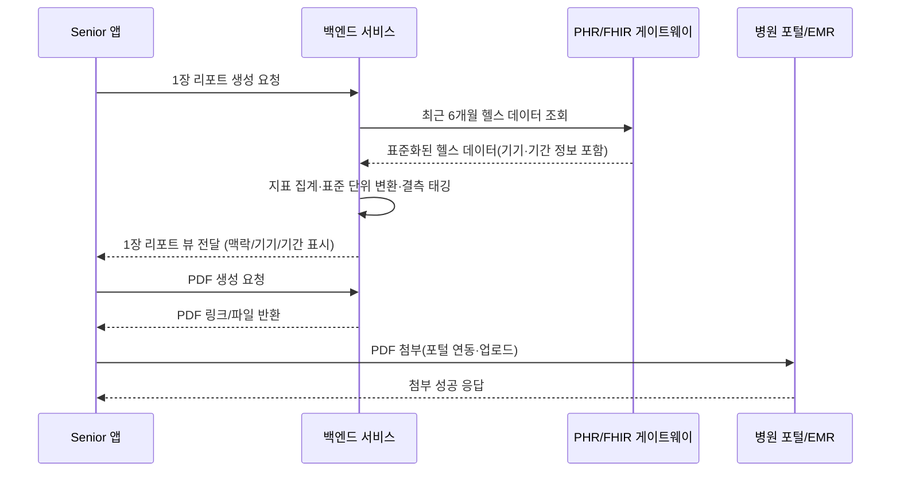
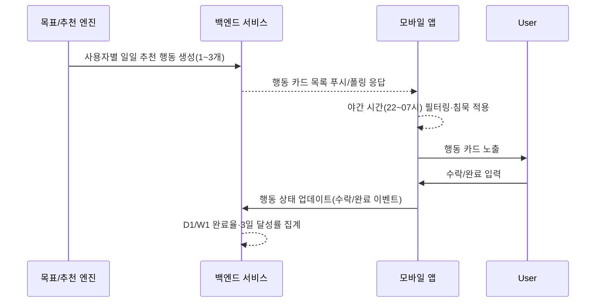
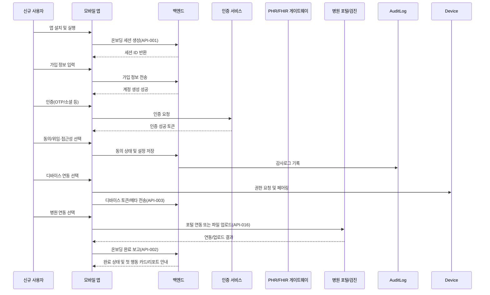
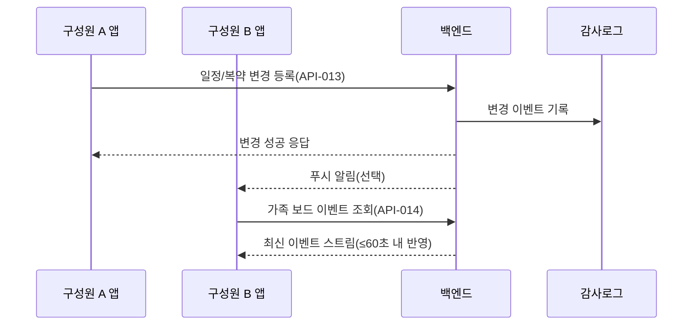
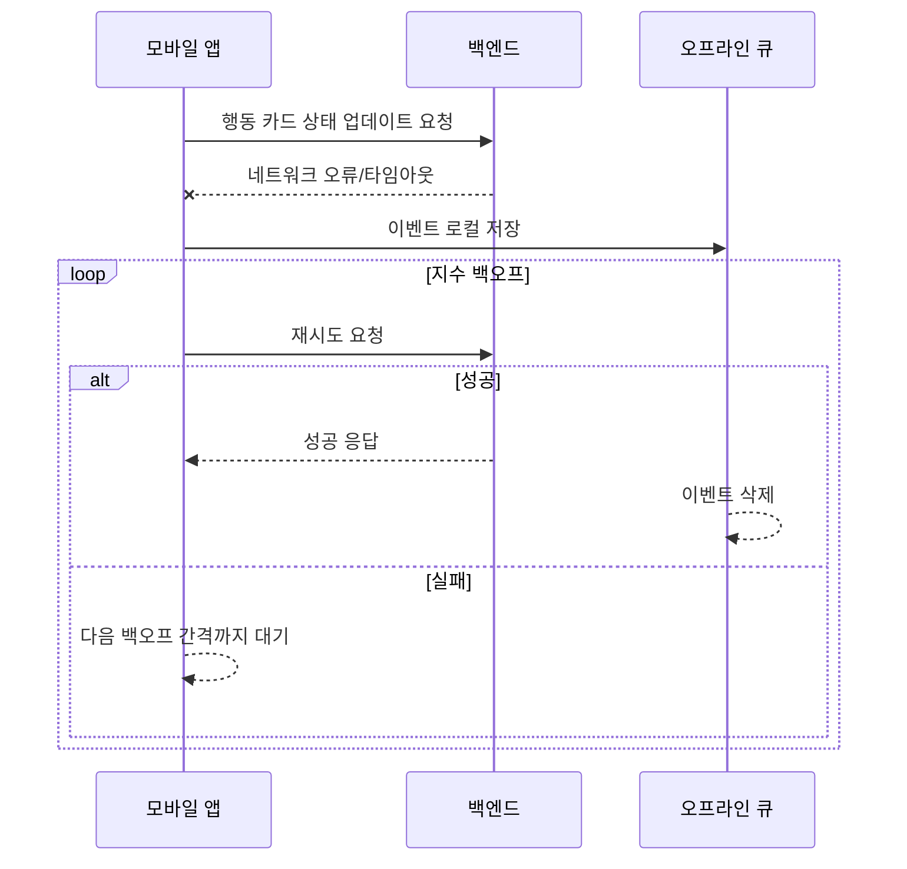

Software Requirements Specification (SRS)  
Document ID: SRS-001  
Revision: 1.0  
Date: 2025-11-14  
Standard: ISO/IEC/IEEE 29148:2018  

-------------------------------------------------

## 1. Introduction

### 1.1 Purpose

본 문서는 시니어 및 보호자 대상 디지털 헬스코칭 제품(이하 “시스템”)의 소프트웨어 요구사항을 정의한다.  
요구사항은 `GPT-PRD v0`를 유일한 비즈니스/기능 요구의 원천으로 삼아, 기능·비기능·인터페이스·데이터·제약을 ISO/IEC/IEEE 29148:2018 기준에 따라 명세한다.  
본 SRS는 설계, 구현, 테스트, 검증, 운영 및 향후 개선을 위한 기준선(Baseline)으로 사용된다.

### 1.2 Scope (In-Scope / Out-of-Scope)

- **In-Scope**
  - **3분 온보딩 일괄 흐름**
    - 가입, 인증, 권한 설정(대리접근 포함), 디바이스/병원 연동을 하나의 End-to-End 플로우로 제공
  - **1장 의사용 요약 리포트**
    - 최근 6개월 헬스 데이터 통합 및 표준화, 의료급 포맷(맥락/기기/기간·결측 태그 포함), PDF/인쇄, EMR 첨부 지원
  - **오늘 1~3개 행동 코칭**
    - 일일 1~3개의 행동 카드 제안, 야간 침묵, 알림 피로 최소화, D1/W1 행동 완료율 관리
  - **가족 공유 보드 및 대리 접근**
    - 초대/동의/역할 템플릿 기반 가족 보드, Viewer/Editor/Admin 권한 모델, 감사로그
  - **병원 포털/검진 1곳 연동**
    - 포털 API 또는 스크래핑 허브를 통한 최소 1개 의료기관/검진 포털 연동
  - **Extreme 시니어 대상 접근성 패키지(A11y)**
    - 대글자, 고대비 테마, 스크린리더 라벨 완전성, 온보딩·리포트 접근성 보장

- **Out-of-Scope (초기 릴리스)**
  - 완전한 EMR 양방향 연동(실시간 쓰기/질의 전 범위)
  - 보험 청구/심사 기능
  - 의료진 대시보드 정식 출시 (파일럿 이후 릴리스 대상)

- **Constraints & Assumptions (제약 및 가정)**
  - **연동 범위 제약**
    - 병원/검진 포털별 연동 범위 편차가 있으며, 1곳 파일럿 연동을 기준으로 확장한다.
  - **Extreme 접근성 구현 난이도**
    - 접근성 요구는 P1 버그 수준으로 관리하며, 완전 충족까지 단계적 개선이 필요하다.
  - **데이터 신뢰·임상 수용성**
    - 맥락/기기/기간 표준 표기와 결측 태깅을 통해 “의사 신뢰 포맷”을 구현하고, 임상 코디자인을 통해 검증한다.
  - **비즈니스 가정**
    - Q1 트리플렛(3분 온보딩·행동 코칭·1장 요약)이 도입/재사용 임계치를 형성한다.
    - B2B2C 채널에서 시니어 원스텝 퍼널이 기관 내 온보딩 병목을 부분 대체할 수 있다.

### 1.3 Definitions, Acronyms, Abbreviations

- **Senior(시니어)**: 본 시스템의 핵심 최종 사용자로, 주로 자신의 건강 정보를 관리하고 외래 진료를 준비하는 고령 사용자.
- **Caregiver(보호자)**: 시니어를 대신하거나 함께 건강·일정·복약을 관리하는 가족 등 대리 사용자.
- **Extreme/Low-Digital Senior**: 디지털 친숙도가 낮고, 작은 글씨·저대비·스크린리더 미지원 환경에서 어려움을 겪는 시니어.
- **Onboarding(온보딩)**: 신규 사용자가 앱 설치 후 가입→인증→권한 설정→디바이스/병원 연동을 완료하여 첫 가치를 경험하는 흐름.
- **1장 의사용 요약 리포트(Doctor One-Page Summary)**: 최근 6개월 핵심 건강 지표를 의료급 포맷으로 집약하여 외래 진료 시 활용하는 1페이지 요약 리포트.
- **오늘 1~3개 행동 카드(Action Card)**: 하루 1~3개의 구체적 행동(복약, 걷기, 검사 준비 등)을 제안하고 완료를 추적하는 인터랙션 단위.
- **가족 보드(Family Board)**: 시니어와 보호자들이 일정·복약·위험 정보를 공유 및 조율하는 공유 화면/공간.
- **Viewer/Editor/Admin**: 가족 보드에서의 역할 템플릿. Viewer(읽기), Editor(읽기+편집 일부), Admin(초대/권한 관리 포함).
- **북극성 KPI(North Star KPI)**: 제품 성패를 대표하는 핵심 지표. 본 시스템에서는 외래 현장 ‘의사용 1장’ 리포트 채택률.
- **보조 KPI(Auxiliary KPI)**: 북극성 KPI 달성을 뒷받침하는 온보딩 완료율, 행동 완료율, 유지율 등 보조 성과 지표.
- **p50/p95**: 성능 지표에서 사용되는 지연 시간 퍼센타일. p50은 중앙값, p95는 상위 5% 이내 지연 시간.
- **SLA**: Service Level Agreement, 가용성 등의 서비스 수준 합의.
- **RPO/RTO**: Recovery Point Objective / Recovery Time Objective.
- **A11y**: Accessibility(접근성).
- **ADR**: Architecture Decision Record.
- **EMR**: Electronic Medical Record(전자의무기록).
- **PHR/FHIR 게이트웨이**: 개인 건강기록/표준 의료 데이터(FHIR)를 연동하는 게이트웨이.
- **DAU**: Daily Active Users.
- **D1/W1/D90**: 첫날/첫주/90일 기준 유지·행동 지표.
- **오경보율(False Positive Rate)**: 실제로 중요하지 않은 이벤트에 대해 알림을 발송한 비율.

### 1.4 References (REF-XX)

- **REF-01**: `GPT-PRD/GPT-PRD.md` – Product Requirement Document (v0)
- **REF-02**: ADR 모음 문서 (파일럿 범위·의사결정 기록, 링크 예정)
- **REF-03**: ISO/IEC/IEEE 29148:2018 – Systems and software engineering — Requirements engineering

### 1.5 Assumptions & Constraints (시스템 내부 - 언어 및 프레임워크)
- C-TEC-001: 모든 프론트엔드 서비스는 Vite 환경 기반의 React.js 프레임워크를 사용한다.
- C-TEC-002: 모든 백엔드 서비스는 JVM 기반(Java 17 + Spring Boot 3.x)을 사용한다.
- C-TEC-003: 데이터베이스는 MySQL 9.x InnoDB 엔진에서 유니코드 확장 문자 인코딩을 기본으로 사용한다.
- C-TEC-004: 문서 자동생성 엔진은 Python 기반(LangChain + FastAPI)으로 구현한다. (시스템 외부 - 연결 및 통신 방식)
- C-TEC-005: LLM 호출은 OpenAI API 또는 사내 LLM Gateway를 사용한다.
- C-TEC-006: MSA 서비스 간 통신은 REST(OpenAPI 3.x) API 또는 gRPC로 제한한다.

---

## 2. Stakeholders

| Stakeholder | 역할(Role) | 책임(Responsibility) | 관심사(Interest) |
|------------|-----------|-----------------------|------------------|
| Senior 사용자 | 핵심 최종 사용자 | 온보딩 완료, 1장 리포트 생성·제시, 일상 행동 수행 | 이해하기 쉬운 1장 요약, 최소한의 조작으로 목표 달성, 접근성, 복약·검사 누락 방지 |
| Caregiver(보호자) | 가족 대리 사용자 | 대리접근 설정, 가족 보드 관리, 일정·복약 조율 | 역할·권한의 명확성, 일정 충돌·알림 피로 감소, 프라이버시 보호 |
| Extreme/Low-Digital Senior | 디지털 취약 사용자 | 접근성 모드 사용, 음성/대글자 중심 상호작용 | 3분 이내 온보딩, 대글자/고대비/스크린리더, 최소 단계 UI |
| 의사(Clinician) | 외래 진료 제공자 | 외래 현장에서 리포트 열람·EMR 첨부, 진료 의사결정 | 1장 리포트의 신뢰성, 맥락/기기/기간 태깅, EMR 워크플로 적합성, 의사결정 시간 단축 |
| 병원/검진 기관 IT | 연동 파트너 | 병원 포털/검진 시스템 연동, 보안·규제 준수 | 포털 API 안전 사용, 데이터 지역성·프라이버시, 운영 안정성 |
| Product/Operations 팀 | 제품·운영 책임 | KPI 달성, 실험 운영, 온콜·비용 관리 | 북극성/보조 KPI 달성, 인프라 비용 한도, 모니터링·알림 체계, 유지보수 용이성 |

---

## 3. System Context and Interfaces

### 3.1 External Systems

- **디바이스 SDK**
  - 스마트워치, 혈압계 등 2종 이상 웨어러블/의료기기 데이터 수집.
- **PHR/FHIR 게이트웨이**
  - 최근 6개월 헬스 데이터(활동·심박·혈압·체중 등) 표준화 조회.
- **병원 포털/검진 시스템**
  - 최소 1개 기관과 계정 연동 및 리포트(PDF) 첨부.
- **인증/알림 인프라**
  - OAuth/OIDC 또는 동급 인증, 푸시 알림/메시지 전송 시스템.
- **로그·모니터링 시스템**
  - 지연, 오류, 가용성, 비용 지표 수집 및 알림 발송.

### 3.2 Client Applications

- **모바일 앱(시니어/보호자 공용 앱)**
  - 플랫폼: iOS/Android (세부 플랫폼은 설계 단계에서 확정).
  - 주요 기능: 온보딩 플로우, 1장 리포트 열람·공유, 행동 카드 확인·완료, 가족 보드 관리, 접근성 모드.
- (선택사항) **웹 포털(의사용/관리용)**
  - 본 SRS에서는 필수 범위에 포함되지 않으며, 향후 의료진 대시보드 정식 출시 시 별도 SRS 작성.

### 3.3 API Overview

아래 API는 기능 요구사항을 지원하기 위한 논리적 엔드포인트 목록이며, 세부 스펙은 Appendix 6.1에 정리한다.

- 온보딩 관리 API
- 사용자/역할·대리접근 관리 API
- 헬스 데이터 조회/표준화 API
- 1장 리포트 생성/조회/내보내기 API
- 행동 카드 생성/조회/상태 업데이트 API
- 가족 보드 일정/복약/변경사항 동기화 API
- 병원 포털 연동 API
- 감사로그/보안 이벤트 API

### 3.4 Interaction Sequences (핵심 시퀀스 다이어그램)

#### 3.4.1 1장 의사용 요약 리포트 생성·활용 (핵심 플로우)

#### 3.4.2 오늘 1~3개 행동 카드 생성·완료 (핵심 플로우)

(상세 시퀀스는 Appendix 6.3에 추가 명세)

---

## 4. Specific Requirements

### 4.1 Functional Requirements

다음 표는 Story를 출처(Source)로 하는 원자적 기능 요구사항을 정의한다.  
ID 형식은 `REQ-FUNC-xxx`이며, Priority는 MSCW 분류를 따른다.

| ID | Description (요구사항) | Source Story | 관련 기능(Fn) | Priority (MSCW) | Acceptance Criteria (요약) |
|----|------------------------|-------------|----------------|-----------------|----------------------------|
| REQ-FUNC-001 | 시스템은 최근 6개월 간 Senior 사용자 헬스 데이터를 통합하여 1장 의사용 요약 리포트를 생성할 수 있어야 한다. | Story 1 (AC1) | F2 | Must | Given 데이터 연동 완료, When 1장 리포트 생성 요청 시, Then p95 생성 시간 ≤ 3초(REQ-NF-004)이고 활동·심박·혈압·체중이 기간·기기·단위 기준으로 표준화되어 표기된다(필드 완결성 ≥ 95%, REQ-NF-005). |
| REQ-FUNC-002 | 시스템은 각 지표별로 측정 기간, 사용 기기, 결측 여부를 리포트에 표시해야 한다. | Story 1 (AC4) | F7 | Must | Given 지표의 측정 맥락/기기 정보 존재, When 리포트 생성 시, Then 각 지표에 기간·기기·결측 태그가 표시되며, 태그 누락율 < 5%(REQ-NF-006). |
| REQ-FUNC-003 | 시스템은 1장 리포트를 PDF로 내보내기 및 인쇄 가능한 포맷으로 제공해야 한다. | Story 1 (AC2) | F2 | Must | Given 외래 대기 중, When 리포트를 열람하면, Then PDF 생성 및 인쇄 버튼을 통해 EMR 첨부 가능한 PDF 파일이 제공된다. |
| REQ-FUNC-004 | 시스템은 1장 리포트를 EMR에 첨부하는 플로우를 3클릭 이내로 제공해야 한다. | Story 1 (AC2) | F2, F5 | Must | Given PDF 생성 완료, When EMR 첨부 플로우를 수행하면, Then 3회 이내 클릭으로 첨부가 완료되며 첨부 실패율 < 0.5%(REQ-NF-007). |
| REQ-FUNC-005 | 시스템은 1장 리포트에 대해 접근성 모드(대글자/고대비/스크린리더 및 문맥 설명 툴팁)를 제공해야 한다. | Story 1 (AC3) | F10 | Should | Given 접근성 모드 활성, When 리포트 열람 시, Then 대글자/고대비 테마 적용 및 모든 인터랙티브 요소에 스크린리더 레이블이 존재하여 라벨 누락 0건(REQ-NF-008)이고, 핵심 용어/지표에 대한 문맥 설명 툴팁 커버리지가 ≥ 90%(REQ-NF-031). |
| REQ-FUNC-006 | 시스템은 하루 사용자당 1~3개의 행동 카드를 생성해야 하며, 이 범위를 초과하는 카드를 생성해서는 안 된다. | Story 2 (AC1) | F3, F9 | Must | Given 알림 창구 설정 완료, When 일일 행동 카드 생성 시, Then 동일 사용자 기준 일일 제안 개수 ∈ [1, 3]이며 0개 또는 4개 이상 제안되는 비율 = 0%이고, 행동 카드 관련 오경보율 < 2%(REQ-NF-032). |
| REQ-FUNC-007 | 시스템은 야간(22:00~07:00) 시간대에 행동 카드 관련 알림을 자동으로 침묵 처리해야 한다. | Story 2 (AC1) | F3, F9 | Must | Given 로컬 시간대 설정, When 시간이 22:00~07:00 사이일 때, Then 행동 카드 푸시 알림은 발송되지 않거나 “조용한 알림”으로만 기록되며, 야간 시간대 소리/배너 알림 비율 0%. |
| REQ-FUNC-008 | 시스템은 행동 카드 수락/완료 이벤트를 기록하여 D1 완료율과 W1 주간 3일 이상 달성률을 계산할 수 있어야 한다. | Story 2 (AC2) | F3 | Must | Given 행동 카드 노출, When 사용자가 수락 또는 완료하면, Then 수락/완료 시각 및 상태가 서버에 기록되고, D1 완료율 ≥ 25%, W1 3일 이상 달성률 ≥ 50%(REQ-NF-009). |
| REQ-FUNC-009 | 시스템은 네트워크 장애 시 행동 카드 및 기타 이벤트를 오프라인 큐에 저장하고, 지수 백오프로 재시도해야 한다. | Story 2 (AC4) | F3, F9 | Could | Given 네트워크 장애, When 동기화 요청 실패 시, Then 이벤트는 로컬 큐에 저장되고, 지수 백오프 전략으로 재시도하여 네트워크 복구 후 데이터 유실 0건(REQ-NF-010). |
| REQ-FUNC-010 | 시스템은 시니어 사용자가 보호자를 초대할 수 있는 초대 링크 발급 기능을 제공해야 한다. | Story 3 (AC1) | F4 | Should | Given 보호자 이메일/연락처 입력, When 초대 발송을 요청하면, Then 1회 동작으로 초대 링크가 생성·발송되고, 초대 발송 실패율 < 1%(REQ-NF-011). |
| REQ-FUNC-011 | 시스템은 보호자가 초대 수락 후 3단계 이내로 대리접근 및 Viewer/Editor/Admin 역할 설정을 완료할 수 있어야 한다. | Story 3 (AC1) | F4, F8 | Should | Given 초대 링크 유효, When 보호자가 링크를 열고 플로우를 진행하면, Then 3단계 이내에 계정 연결·대리접근 동의·역할 선택이 완료된다. |
| REQ-FUNC-012 | 시스템은 가족 보드의 일정/약 변경 사항을 모든 구성원에게 동기화해야 한다. | Story 3 (AC2) | F4 | Should | Given 가족 보드 일정/약 변경, When 다른 구성원이 보드를 열람하면, Then 변경 전파 지연 ≤ 60초(REQ-NF-003)이며, 동시 변경 충돌 시 최신 기준으로 병합하고 변경 이력·감사로그를 기록한다. |
| REQ-FUNC-013 | 시스템은 민감정보(건강 데이터, 권한 설정 등) 접근 시 이상 위치/시간 접근을 탐지하고 추가 인증을 요구해야 한다. | Story 3 (AC3) | F8 | Should | Given 비정상 위치/시간 접근 탐지, When 보호자 또는 시니어가 민감정보에 접근하면, Then OTP/바이오 인증 중 하나를 요구하고, 인증 실패 시 접근을 차단하며 알림을 발송한다. |
| REQ-FUNC-014 | 시스템은 만료된 초대 링크에 대해 1클릭으로 새 초대 링크를 재발급하는 기능을 제공해야 한다. | Story 3 (AC4) | F4 | Should | Given 초대 링크 만료, When 보호자 또는 시니어가 재요청하면, Then 1클릭으로 새 링크가 발급·발송되고, 재발급 실패율 < 1%(REQ-NF-011). |
| REQ-FUNC-015 | 시스템은 신규 사용자의 가입→인증→권한 설정→디바이스/병원 연동을 하나의 온보딩 플로우로 제공해야 한다. | Story 4 (AC1) | F1, F5 | Must | Given 신규 설치, When 온보딩 플로우 실행 시, Then 위 4단계를 순차 또는 논리적 그룹으로 제공하고, 전체 플로우 p50 완료 시간 ≤ 180초, 성공률 ≥ 65%(REQ-NF-012). |
| REQ-FUNC-016 | 시스템은 온보딩 각 단계에서 되돌아가기 및 중간 저장 기능을 제공해야 한다. | Story 4 (AC2) | F1 | Must | Given 온보딩 진행 중, When 사용자가 이전 단계로 이동 또는 앱을 종료했다가 재시작하면, Then 마지막 완료 단계 이후부터 재개 가능하며, 단계별 이탈률 ≤ 15%(REQ-NF-013). |
| REQ-FUNC-017 | 시스템은 온보딩 화면에 대해 스크린리더 라벨 완전성 및 포커스 관리가 보장되는 접근성 모드를 제공해야 한다. | Story 4 (AC3) | F10 | Should | Given 접근성 설정 활성, When 온보딩 화면 탐색 시, Then 모든 포커스 가능한 요소에 라벨이 존재하고 포커스 트랩이 없으며, 폼 오류 발생 시 오류 힌트가 100% 노출된다(REQ-NF-008). |
| REQ-FUNC-018 | 시스템은 병원 포털 미지원 지역 사용자에게 파일 업로드 기반 대체 연동 경로와 CS 티켓 자동 생성 기능을 제공해야 한다. | Story 4 (AC4) | F5 | Should | Given 병원 포털 미지원 지역, When 사용자가 연동을 선택하면, Then 파일 업로드 가이드가 제공되고, 2클릭 이내 CS 티켓이 생성된다. |
| REQ-FUNC-019 | 시스템은 최소 2종(워치, 혈압계)의 디바이스 데이터를 통합하여 멀티디바이스 정합성을 유지해야 한다. | Story 1 (간접), Story 4 (연동 니즈) | F6 | Could | Given 두 디바이스 모두 연동, When 6개월 데이터 조회 시, Then 동일 지표(예: 심박, 혈압)에 대해 기기 간 단위·타임존을 정규화하고, 충돌 시 우선순위 규칙에 따라 단일 값으로 노출한다. |

> 주: 각 Acceptance Criteria 중 성능/품질 수치는 대응하는 REQ-NF-xxx와 상호 참조된다.

---

### 4.2 Non-Functional Requirements

다음 표는 성능, 가용성, 보안, 비용, 모니터링, 확장성, 유지보수성 등에 관한 비기능 요구사항을 정의한다.  
ID 형식은 `REQ-NF-xxx`이다.

| ID | Category | Description (요구사항) | Metric/Target | Source (PRD) |
|----|----------|------------------------|---------------|--------------|
| REQ-NF-001 | Performance | 앱 초기 로드 성능 | 앱 초기 로드 p95 ≤ 1.5초 | PRD 5, L118-119 |
| REQ-NF-002 | Performance | 주요 화면 전환 성능 | 온보딩·행동 카드·리포트 화면 전환 p95 ≤ 800ms | PRD 5, L118-120; Story 2 AC3 |
| REQ-NF-003 | Performance/Reliability | 가족 보드·알림 데이터 동기화 지연 | 변경 전파 지연 p95 ≤ 60초 | PRD 5, L123; Story 3 AC2 |
| REQ-NF-004 | Performance | 1장 리포트 생성 성능 | 리포트 생성 p95 ≤ 3초 | PRD 5, L120; Story 1 AC1 |
| REQ-NF-005 | Data Quality | 리포트 지표 필드 완결성 | 주요 지표 필드 완결성 ≥ 95% | Story 1 AC1 |
| REQ-NF-006 | Data Quality | 맥락/기기/기간/결측 태그 완결성 | 태그 누락율 < 5% | Story 1 AC4 |
| REQ-NF-007 | Reliability | EMR 첨부 실패율 | 리포트 EMR 첨부 실패율 < 0.5% | Story 1 AC2 |
| REQ-NF-008 | Usability/Accessibility | 접근성 품질 | 접근성 모드에서 스크린리더 라벨 누락 0건, 온보딩/리포트 화면 포커스 트랩 0건, 오류 힌트 노출율 100% | Story 1 AC3; Story 4 AC3; F10 |
| REQ-NF-009 | Product KPI | 행동 카드 완성도 (실험 최소 기준) | D1 행동 완료율 ≥ 25%, W1 주간 3일 이상 달성률 ≥ 50% | Story 2 AC2; PRD 1 보조 KPI |
| REQ-NF-010 | Reliability | 네트워크 장애 시 데이터 유실 | 오프라인 큐잉 및 재시도 후 데이터 유실 0건 | Story 2 AC4 |
| REQ-NF-011 | Reliability | 초대/재초대 실패율 | 초대 및 재초대 실패율 각각 < 1% | Story 3 AC4 |
| REQ-NF-012 | Product KPI | 온보딩 퍼널 KPI | 온보딩 p50 완료 시간 ≤ 180초, 전체 성공률 ≥ 65% | Story 4 AC1; PRD 1 보조 KPI |
| REQ-NF-013 | Product KPI | 온보딩 단계별 이탈률 | 각 단계별 이탈률 ≤ 15% | Story 4 AC2 |
| REQ-NF-014 | Availability | 서비스 가용성 | 월 가용성 ≥ 99.5% | PRD 5, L121-122 |
| REQ-NF-015 | Reliability | 백엔드 오류율 | 서버 오류율(5xx 등) < 0.5% | PRD 5, L121-122 |
| REQ-NF-016 | Security | 암호화 및 데이터 보호 | 전송 구간 TLS 1.2 이상, 저장 데이터 AES-256 수준 암호화, 최소 권한 원칙 준수 | PRD 5, L124-126 |
| REQ-NF-017 | Security | 위험 기반 인증 | 고위험 위치/시간·행동 탐지 시 2FA(OTP/바이오) 요구 및 감사로그 기록 | PRD 5, L125-126; Story 3 AC3 |
| REQ-NF-018 | Compliance/Audit | 동의/위임/감사로그 | 동의·위임·역할 변경·민감정보 접근 이벤트 100% 감사로그 기록 | PRD 5, L125-126; F4, F8 |
| REQ-NF-019 | Cost | 인프라 비용 | 유효 DAU 기준 사용자당 월 인프라 비용 ≤ $0.25 | PRD 5, L127-128 |
| REQ-NF-020 | Cost | 데이터 저장 비용 | 사용자당 월 데이터 저장 비용 ≤ $0.05 | PRD 5, L127-128 |
| REQ-NF-021 | Monitoring | 모니터링 대시보드 | 지연/오류/가용성·비용 지표를 통합 모니터링 대시보드에서 실시간(≤1분 지연)으로 제공 | PRD 5, L129-131 |
| REQ-NF-022 | Alerting | 알림·에스컬레이션 | 임계치 초과 후 5분 이내 온콜 알림 발송, 동일 이슈 반복 시 단계적 에스컬레이션 | PRD 5, L129-131 |
| REQ-NF-023 | Product KPI | 북극성 KPI – 1장 리포트 채택률 | 파일럿 기준 외래 현장 1장 리포트 채택률 목표 ≥ 40% (기준선 10%) | PRD 1, L9-13; 실험 3 |
| REQ-NF-024 | Product KPI | 1장 리포트 현장 성과 | 의사/환자 평점(5점 만점) ≥ 4.2, 의사결정 시간 -20% 이상 단축 | PRD 1, L40-43; PRD 7, L162-167 |
| REQ-NF-025 | Product KPI | 가족 대리접근 설정률 | 가족 대리접근 설정률 목표 ≥ 50% (기준선 20%) | PRD 1, L28-31 |
| REQ-NF-026 | Product KPI | 90일 유지율 | D90 유지율 목표 ≥ 35% (기준선 20%) | PRD 1, L32-35 |
| REQ-NF-027 | Product KPI | 복약 순응도 향상 | 파일럿 기준 복약 완료율 +15%p 향상 | PRD 1, L36-39 |
| REQ-NF-028 | Scalability | 확장성 | 동시 접속 5,000 사용자 환경에서 REQ-NF-001~004의 성능 기준을 95% 이상 세션에서 충족 | Derived (Scalability 요구, 수치화) |
| REQ-NF-029 | Maintainability | 유지보수성 | 핵심 서비스 코드 유닛 테스트 커버리지 ≥ 70%, 릴리즈 이후 7일 내 P1 회귀 버그율 < 2% | Derived (Maintainability 요구, 수치화) |
| REQ-NF-030 | Experimentation | 실험 성공 기준 | 실험 1/2/3 각각 PRD 7에 정의된 성공 기준을 충족할 경우, 해당 기능·설계안은 채택 후보로 간주 | PRD 7, L148-167 |
| REQ-NF-031 | Usability/Accessibility | 1장 리포트 문맥 설명 툴팁 커버리지 | 1장 리포트 내 핵심 지표·용어에 대한 문맥 설명 툴팁 커버리지 ≥ 90% | Story 1 AC3 |
| REQ-NF-032 | Product KPI | 행동 카드 오경보율 | 행동 카드 알림 중 실제 행동 필요가 없거나 중복으로 간주되는 오경보율 < 2% | Story 2 AC1; PRD 7, L155-160 |
| REQ-NF-033 | Product KPI | 행동 카드 장기 KPI (제품 목표) | 장기 제품 KPI로서 D1 행동 완료율 ≥ 60%, W1 주간 3일 이상 달성률 ≥ 50% | PRD 1, L20-23; PRD 7, L155-160 |
| REQ-NF-034 | Product KPI | 월간 ‘의사용 1장’ 생성률 | 월간 고유 활성 사용자 대비 1장 리포트 생성 사용자 비율 ≥ 50% (기준선 20%) | PRD 1, L24-27 |

---

## 5. Traceability Matrix

Story ↔ Functional Requirement ↔ Test Case 간 추적성을 아래와 같이 정의한다.  
Test Case ID 형식은 `TC-xxx`이다 (테스트 케이스 상세는 별도 테스트 명세서에서 정의).

| Story ID | Story 요약 | 관련 기능(Fn) | Requirement IDs (REQ-FUNC / REQ-NF) | Test Case IDs (예시) |
|----------|------------|----------------|--------------------------------------|-----------------------|
| Story 1 | Senior가 외래에서 제시할 1장 의사용 요약을 원함 | F2, F7, F6 | REQ-FUNC-001, 002, 003, 004, 005, 019; REQ-NF-004~007, 005, 006, 008, 023, 024, 031, 034 | TC-001~TC-015 |
| Story 2 | Senior가 하루 1~3개의 실행 가능한 행동을 원함 | F3, F9 | REQ-FUNC-006, 007, 008, 009; REQ-NF-002, 003, 009, 010, 032, 033 | TC-016~TC-025 |
| Story 3 | Caregiver가 역할 분담 가능한 가족 보드를 원함 | F4, F5, F8 | REQ-FUNC-010, 011, 012, 013, 014; REQ-NF-003, 011, 016, 017, 018, 025 | TC-026~TC-038 |
| Story 4 | New user가 3분 내 온보딩 완료 후 첫 가치를 원함 | F1, F5, F10 | REQ-FUNC-015, 016, 017, 018; REQ-NF-001, 002, 008, 012, 013, 021, 022, 026 | TC-039~TC-050 |

> 실제 TC-xxx는 테스트 설계 시 각 REQ에 대해 최소 1개 이상의 테스트 케이스를 매핑한다.

---

## 6. Appendix

### 6.1 API Endpoint List

아래 API 엔드포인트는 논리적 설계 수준의 목록이며, 세부 파라미터·에러 코드는 추후 API 명세서에서 상세화한다.

| API ID | Method | Path (예시) | Purpose | 관련 REQ |
|--------|--------|------------|---------|----------|
| API-001 | POST | `/api/v1/onboarding/start` | 온보딩 세션 생성 (가입·인증 플로우 시작) | REQ-FUNC-015, 016; REQ-NF-012, 013 |
| API-002 | POST | `/api/v1/onboarding/complete` | 온보딩 완료 기록 및 KPI 로깅 | REQ-FUNC-015; REQ-NF-012, 013, 026 |
| API-003 | POST | `/api/v1/devices/link` | 디바이스 연동 및 멀티디바이스 연결 | REQ-FUNC-015, 019; REQ-NF-004, 005 |
| API-004 | GET | `/api/v1/health-metrics/summary` | 최근 6개월 헬스 데이터 요약 조회 | REQ-FUNC-001, 019 |
| API-005 | POST | `/api/v1/reports/one-page` | 1장 의사용 요약 생성 | REQ-FUNC-001, 002; REQ-NF-004~006 |
| API-006 | GET | `/api/v1/reports/one-page/{id}` | 1장 리포트 상세 조회 | REQ-FUNC-003, 005 |
| API-007 | GET | `/api/v1/reports/one-page/{id}/pdf` | 리포트 PDF 다운로드 | REQ-FUNC-003, 004; REQ-NF-007 |
| API-008 | POST | `/api/v1/actions/daily` | 오늘 1~3개 행동 카드 생성 | REQ-FUNC-006, 008; REQ-NF-009, 032, 033 |
| API-009 | PATCH | `/api/v1/actions/{id}` | 행동 카드 상태(수락/완료) 업데이트 | REQ-FUNC-008, 009 |
| API-010 | POST | `/api/v1/family-board/invitations` | 가족 보드 초대 발송 | REQ-FUNC-010, 011; REQ-NF-011 |
| API-011 | POST | `/api/v1/family-board/invitations/{token}/accept` | 초대 수락 및 역할 설정 | REQ-FUNC-011; REQ-NF-018 |
| API-012 | POST | `/api/v1/family-board/invitations/{token}/resend` | 초대 재발송/재발급 | REQ-FUNC-014; REQ-NF-011 |
| API-013 | POST | `/api/v1/family-board/events` | 가족 보드 일정/복약 변경 등록 | REQ-FUNC-012; REQ-NF-003, 018 |
| API-014 | GET | `/api/v1/family-board/events` | 가족 보드 이벤트 조회(동기화) | REQ-FUNC-012; REQ-NF-003 |
| API-015 | POST | `/api/v1/security/challenge` | 위험 기반 추가 인증(OTP/바이오) 요청 | REQ-FUNC-013; REQ-NF-017 |
| API-016 | POST | `/api/v1/hospital/upload` | 병원 포털 미지원 시 파일 업로드 및 CS 티켓 생성 | REQ-FUNC-018; REQ-NF-016, 020 |

### 6.2 Entity & Data Model

주요 엔터티 및 데이터 모델은 아래와 같이 구조화한다. (Type은 논리적 타입 기준)

#### 6.2.1 User & Role

| Field | Type | Description | Constraints |
|-------|------|-------------|-------------|
| user_id | UUID | 사용자 고유 식별자 | PK, Not Null |
| user_type | Enum(SENIOR, CAREGIVER) | 사용자 유형 | Not Null |
| primary_senior_id | UUID | CAREGIVER의 경우 연결된 시니어 ID | Nullable, FK(User.user_id) |
| accessibility_mode | Boolean | 접근성 모드 활성 여부 | Default: false |
| created_at | Datetime | 생성 시각 | Not Null |
| updated_at | Datetime | 수정 시각 | Not Null |

#### 6.2.2 FamilyBoard & Membership

| Field | Type | Description | Constraints |
|-------|------|-------------|-------------|
| board_id | UUID | 가족 보드 ID | PK |
| owner_senior_id | UUID | 보드 소유 시니어 ID | FK(User.user_id) |
| created_at | Datetime | 생성 시각 | Not Null |
| member_id | UUID | 구성원 사용자 ID | PK(board_id, member_id) |
| role | Enum(VIEWER, EDITOR, ADMIN) | 권한 역할 | Not Null |
| invited_by | UUID | 초대한 사용자 ID | Nullable |
| invitation_status | Enum(PENDING, ACCEPTED, EXPIRED) | 초대 상태 | Not Null |
| invitation_token | String | 초대 토큰 | Unique, Nullable |

#### 6.2.3 HealthMetric & Device

| Field | Type | Description | Constraints |
|-------|------|-------------|-------------|
| metric_id | UUID | 헬스 지표 ID | PK |
| user_id | UUID | 사용자 ID | FK(User.user_id) |
| metric_type | Enum(STEPS, HR, BP_SYS, BP_DIA, WEIGHT, etc.) | 지표 타입 | Not Null |
| value | Number | 측정 값 | Not Null |
| unit | String | 단위 (표준화 후 값) | Not Null |
| device_id | UUID | 측정 기기 ID | FK(Device.device_id) |
| measured_at | Datetime | 측정 시각 | Not Null |
| context_tags | JSON | 맥락 태그(기간, 기기 메타, 결측 여부 등) | Not Null |

| Field | Type | Description | Constraints |
|-------|------|-------------|-------------|
| device_id | UUID | 기기 ID | PK |
| device_type | Enum(WATCH, BP_MONITOR, etc.) | 기기 유형 | Not Null |
| vendor | String | 제조사/벤더 | Nullable |
| model | String | 모델명 | Nullable |

#### 6.2.4 OnePageReport

| Field | Type | Description | Constraints |
|-------|------|-------------|-------------|
| report_id | UUID | 리포트 ID | PK |
| user_id | UUID | 대상 시니어 사용자 ID | FK(User.user_id) |
| period_start | Date | 리포트 데이터 시작일 | Not Null |
| period_end | Date | 리포트 데이터 종료일 | Not Null |
| summary_payload | JSON | 지표 요약, 표준 단위 값, 맥락·기기·결측 태그 포함 | Not Null |
| pdf_url | String | PDF 파일 경로/URL | Nullable |
| created_at | Datetime | 생성 시각 | Not Null |

#### 6.2.5 ActionCard

| Field | Type | Description | Constraints |
|-------|------|-------------|-------------|
| action_id | UUID | 행동 카드 ID | PK |
| user_id | UUID | 대상 사용자 ID | FK(User.user_id) |
| date | Date | 행동 제안 날짜 | Not Null |
| title | String | 행동 제목 | Not Null |
| description | String | 행동 설명 | Nullable |
| status | Enum(PENDING, ACCEPTED, COMPLETED) | 현재 상태 | Not Null |
| created_at | Datetime | 생성 시각 | Not Null |
| completed_at | Datetime | 완료 시각 | Nullable |

#### 6.2.6 OnboardingSession

| Field | Type | Description | Constraints |
|-------|------|-------------|-------------|
| session_id | UUID | 온보딩 세션 ID | PK |
| user_id | UUID | 사용자 ID | FK(User.user_id) |
| step | Enum(SIGNUP, VERIFY, CONSENT, DEVICE_LINK, HOSPITAL_LINK, COMPLETED) | 현재 단계 | Not Null |
| started_at | Datetime | 플로우 시작 시각 | Not Null |
| completed_at | Datetime | 플로우 완료 시각 | Nullable |
| abandoned | Boolean | 중단 여부 | Default: false |

#### 6.2.7 AuditLog

| Field | Type | Description | Constraints |
|-------|------|-------------|-------------|
| log_id | UUID | 로그 ID | PK |
| user_id | UUID | 행위 주체 | Nullable |
| event_type | String | 이벤트 타입(동의, 위임, 권한 변경, 민감정보 조회 등) | Not Null |
| resource_id | String | 관련 리소스 ID | Nullable |
| created_at | Datetime | 이벤트 시각 | Not Null |
| metadata | JSON | 추가 메타데이터 | Nullable |

### 6.3 Detailed Interaction Models

#### 6.3.1 온보딩 3분 플로우 상세 시퀀스

#### 6.3.2 가족 보드 일정/복약 동기화 상세 시퀀스

#### 6.3.3 오늘 1~3개 행동 카드 실패·재시도 플로우

---

**요약**: 위 SRS 확정본은 기존 SRS에 대해 PRD의 모든 Story·AC·KPI를 재점검하여, 누락되었던 툴팁 커버리지·오경보율·행동 KPI·월간 리포트 생성률 등을 추가 NFR로 반영하고, 관련 REQ-FUNC·Traceability·API 매핑을 보완함으로써 ISO 29148 기반 Definition of Done을 충족한다.

